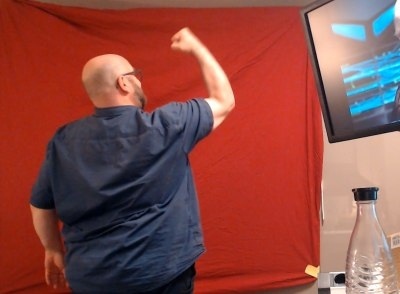

# 420 years of Teletext

Started on June 5th, 2022, finished on August 5th at [evoke 2022](https://evoke.eu).
* [YouTube recording](https://www.youtube.com/watch?v=v7M-eRMzWWA)
* [Pouet page](https://www.pouet.net/prod.php?which=91931)

Credits and stuff:
* Music by bod/AttentionWhore
* Code and graphics by losso/AttentionWhore
* raspi-teletext by ali1234/Alistair Buxton
* BlendComposite.java Copyright (c) 2006 Romain Guy <romain.guy@mac.com>

## How to run

Uses kotlin and [raspi-teletext](https://github.com/ali1234/raspi-teletext),
needs a JVM and runs on the Raspberry Pi.
Accepts packets via network, so for smaller/older Raspberries, Teletext packets can be
fed externally (haven't tested the JVM overhead on a Raspi Zero, maybe
that even works). Development was done using IntelliJ, that should set up kotlin
libraries and everything for you. When built, you need to transfer the `out/production/420-years-of-teletext`
directory to the Raspi as well as the kotlin stdlibs.

Since I needed it for development anyway, this repo also contains a more-or-less complete
Teletext emulation to preview effects and help with syncing. In other words, you
can try/preview everything without a Teletext-rendering Raspberry connected.

Hardwire-wise, you only need a special composite-video cable; the builtin 3.5 mm jack
of the Raspberry Pi provides audio *and* video. 

[Details: how to run](notes/HowToRun.md)

## Background

The initial question was: Could an Amiga create a Teletext-compatible video signal?
It is not quite obvious that this is possible (there are some EAB threads on that:
[2008](http://eab.abime.net/showthread.php?t=39670),
[2020](https://eab.abime.net/showthread.php?t=101915) – pixel timing and displaying something in the
vertical blank area might prove difficult).

Then I stumbled upon [raspi-teletext](https://github.com/ali1234/raspi-teletext) by Alistair Buxton, released
in 2015. Since [other demos](https://www.pouet.net/prod.php?which=67927) already used that,
I decided to look into that first and get familiar with the Teletext business.

After some prototyping, things started to look nice enough, and I decided to
postpone the hassle on the Amiga side and just go with a "pure" Teletext demo.

I actually had the dream of doing something with Teletext since I was 16, and I'm glad
it worked out. At the time, I thought about of doing a Teletext emulation on the Amiga, similar to
the Teletext-style [demos running on BBC micros](https://www.pouet.net/prod.php?which=70465). This was probably inspired by watching the Teletext-y looking
Datex-J decoder dialing into Deutsche Telekom's "internet gateway" many, many times...

## Teletext Tech: Transmission

raspi-teletext renders the Teletext packets into designated, normally "invisble" lines
during vertial blank. If you run raspi-teletext's renderer without the display-area-shifting
command first (`tvctl on`), you should be able to see the pixel output on your TV.
If you squint, you can even make out the page structure (here shown as an overlay):

raspi-teletext only takes care of the so-called clock run-in and sends the rest
of the data as-is. Each Teletext packet consists of 42 bytes and makes up a row
of Teletext display (roughly speaking). See: [Packet format](packet-format.md)

Mode of operation:
* Each frame is rendered into a 40×24 buffer of 7-bit chars
* Constantly send page 100
* As suggested by the [Teletext spec](https://www.etsi.org/deliver/etsi_i_ets/300700_300799/300706/01_60/ets_300706e01p.pdf), send a header for page 1FF inbetween that acts as a timing filler packet,
  hinting to the Teletext decoder that magazine 1 (the pages in the 1xx range) is complete 
* Trial-and-error has shown that 25 fps are possible on "good" TVs (more on that below)
* No advanded features are used (modern Teletext versions with better graphics, TOP Teletext, etc.)

Interesting tech tidbits:
* Page numbers are actually hexadecimal (we only use 100 and 1FF)
* Teletext packets use a mix of [Hamming encoding](hamming.md) for control data and parity bits for character data
  * Normal row
    * 2 bytes of Hamming-encoded address, first page digit (magazine) and row (packet) number, called MPAG
    * 40 bytes of characters with parity bit
  * Page header (row 0)
    * Hamming-encoded, with single bits spread all over the place:
      * MPAG address as with normal pages: first page digit, row (packet) number 0
      * Two-digit page number within magazine ("00" for page 100)
      * Sub-page (e.g. "0000") with flag bits interspearsed
      * More page flags
      * Teletext region (3 bits)
    * 32 bytes of characters with parity bit
* Because of the page header in the first row, the first 8 characters of the 40×24 character display cannot
  be used (the Teletext decoder usually displays the current page number here, e.g. `  P100 ` or something)
* Pages do not need to be updated in order, or completely; you can update single rows as
  needed (not used in this demo)
* There are interesting-sounding page flags like "Newsflash" or "Update indicator", but I couldn't speed up the
  page refresh with them (on horrible Teletext-decoding TVs, that is; the trusty old Nokia TV luckily didn't need
  special flags)

## Teletext Tech: Encoding

Then there's of course the world of Teletext colors, charsets, spec levels and display shenannigans.

Here's a [nice overview of the charset and graphical commands](https://galax.xyz/TELETEXT/CHARSET.HTM). Basically:
* 8 colors (black, blue, red, magenta, green, cyan, yellow, white)
* Mosaic graphic characters (with 2×3 blocks per character)
* Commands to switch the foreground color, but not the background color (only to black)
* Commands to switch special modes on and off: blink, double height, reveal, mosaic graphics with "separated" look

Interesting to know:

* As the row length is fixed, color changes and other mode changes (blinking, graphics mode, hidden text etc.) take up one character –
  you cannot change foreground color within a word, or change foreground and background color
  at once.
  * Example:
  to go from white-on-black text to green-on-yellow, you need three bytes
    * `0x03` – set foreground to yellow 
    * `0x1d` – special command "use foreground color as background color now"
    * `0x02` – set foreground to green
  * To avoid visible gaps during mode/color schemes, there is a special "hold graphics" mode:
    if you change a color with hold mode active, the last graphical character gets repeated. That was especially useful in the plasma effect.
* Character modes get reset at each line – you always start with white on black text
  * Want white graphics on blue background everywhere? Waste 3 chars at the start of each line! (Foreground blue, new background, foreground white) 
  * Bitmap graphics with one color on black background are easier, only 1 byte needed ("set foreground X in graphics mode")
* You can load up the various `.bin` page dumps in the [gfx](gfx/) directory into an
  [online Teletext editor](https://zxnet.co.uk/teletext/editor/) to see how color changes etc. work.
  Good examples of "more complicated than it looks":
  * [Evoke logo](https://zxnet.co.uk/teletext/editor/#0:QIKDFgwQIECBAgQIECBAgQIECBAgQIECBAgQIECBAgQIECAudJIECBAgQcPnz______N70YIECBAgQIECBAgQIEGDAgQIC50ggQIEavf______-cJI150vr_______________oUGvS_LnSSBBg-HSCI4XQIECBAgJIjpfX__73_______792gQIFXkudJIEG7-dIIFRwugQIECBASVHS__unQ73f____7UqBAgQIy50kgQJv3____nECBAgQIECAkdLv0aRAgVt9__-3QIECBBgLnSSBAg3f_6dOgQIEHr_____71ug3_zpDx-___79OjQF8HYudJIECBAjQoECBBg3f______pkCBEdIfv____QoC6BAgffi50kgQIECBAgQIMHf9___zz5CgL_zhJKgQIEHo6XQIEHrx_LnSCBAg____85_JcPh0ugcHSDBAgQIP__-dJfzpdAg0ff_8udIIECA4gQICWD8dLoEGL8dINUCBAg___50l_Ol0GDr___y50ggQIDiBAgJfjpdBgyff50h9YIECD___nSR0ugQev3___LnSCBAgOIECAl_Ol8GD9__nSH__84IP__-dJHS6BB_____8udIIECDWcQICW86Xwb__86Qwf_______zpLAdLoECj_v__y50uewMCRxAgJIjpft__nSGD9________Okvx0ugQIEXf__LnSSBB4OkFe84XQI169evRoECBAgQICWDx-_nS6BAgQIt_8udJIHXs6XQIECDx_fnECBAX___vRggQEkSv-dLoECBAgR7y50ko9fzpdAgQIEyFIcQIEBI6XcnSGv__OklR0uwQIECBAwLnSWX____________5xAgQHjpc6S_EP____JP0KFX__99_0udJbv___________enECBAgOl_aZAQOf0CAudJIECr__3uy50kr_______Xq0aBAcQIEBc6ScHSCD__Pfy50kgQKNPtstLnSSF2vXp0aBAgIINBz___l9Z0k7OkFX_-dL6zpJAgRbUKEudJIECNAgQEECBB4_nP__-XQKzpLcrIK_50ugV7_______y50ggQIECBAgQLF69evXr169evXrCSBAQRK169evWrECBAgQIECBAgQIECBAgQIECBAgQIECBAgQIECBAgQIECBAgQIECA:PS=0:RE=0:zx=BA2)
  * [AttentionWhore logo](https://zxnet.co.uk/teletext/editor/#0:YsmbRq2buECBAgQIECBAgI-P_RAgQIECBAgQIECBAgQIECAgdQIECBAgQIECBAgQIEBHQd_kFX___________________yB1AgQIECBAgQIECBAgI6Dv___Ia___________________IHUCBAgQIECBAgQIEBHQddl-CBAQ1_________________8gdQIECBAgQIECBAgQEf50v6_9UCAhv________________yB0igQIECBAgQIECBB6Ol9H___aICCr________________IHSKBAgQIECBAgQIPB0vo_____-0QEFf______________8gdIoECBAgQIECBBoOl9H_______9ogIa______________yB0igQIECBAgQIMB0ugOkPn7__R_yP86Q3_____________IHSKBAgQIECBBg_HS_o6QV____81IqjpBFv___________8gdIoECBAgQIEHo6X8HSCBBq____1ARVnSCr___________yB0igQIECBAg9HS-g6QQIECD___tUCAjrOkFX__________IHSKBAgQIEGg6XwHSCBAgQIPX_-hQIEBHedIa_________8gdIoECBAgwHS6D8dIIECBB6___6BAgQEUX86Q3________yB0igQIEGA6XQfjpBAgQINH____oECBAgIov50hv_______IHSKBAgQfjpf0dIIECBAg1f0v_-gQIECBARVHSCL______8gdIoECD0dL6DpBAgQIECDU_Qav6BAgQIECAjrOkFX_____yB0igQejpfAdIIECBAgQIP6VAq_oECBAgQIEBHedIKv____IHSKDQdL4DpBAgQIECBB6_-eHD-gQIECBAgQICO86Q1___8gdI4P50v-OkECBAgQIEH9CiQoP6BAgQIECBAgIov50hv__yB0j-Ol_R0ggQIECBAg1NUCBAg9tECBAgQIECBARVHSCL__IoPx0voOkECBAgQIECBcgQIECBEtQIECBAgQIECAjrOkEX8j6_______________________________________86QQKiO________________________________________zpBBgQIECBAgQIECBAgQIECBAgQIECBAgQIECBAgQIECBAgQIECA:PS=0:RE=0:zx=BA2)
  * [Scrolltext chars](https://zxnet.co.uk/teletext/editor/#0:QMGLJm0atm7hAwYsmbRq2buEDBiyZtGrZu4QMGLJm0atm7gisWLFixYsWLECxYsWLFixYsQLFixYsWLFixAsWLFixYsWLDxdB____5XQgQF______ldCBAXQf___-V0IEBf_____5XQgPF_5XQsL_yuhAX_ldCwv_K6EBf-V0LC_8roQF_5XQsL_yug8X_______K6kBf_____5XQuQF_5XUgQKFi5AX_ldSAv_K6jxf-V0LC_8rqQF_5XQsL_yuhAX_ldSAv_K6EBf-V1IC_8rqPF_5XUgL_yupAX_____-V0LkBdB____5XQuQF______ldC48VULFyBAgWLkBVQsWLFixcgQFUChYsWLFyBAVULFixYsXICKxYsWLFixYgQLFixYsWLFiBAsWLFixYsWLECxYsWLFixYsPF______ldCBAX_____-V0IEBdB____5XQgQF_5XQgL_yug8X_ldCxYsXIEBf-V0LFixcgQF_5XQsWLFyBAX_ldSAv_K6jxf___ldCBAgQF___-V0IECBAX_ldSAv_K6EBf______8rqPF_5XQsXIECBAX_ldCxcgQIEBf-V1IC_8rqQF_5XQsL_yuo8X_____-V0IEBf-V1IECBAgQF0H_____yupAX_ldSAv_K6jxVQsWLFixcgQFVCxcgQIECBAVQKFixYsWLkBVQsXIEChYuIrFixYgQIECBAsWLFixYsWLECxYsWLFixYsQLFixYsWLECA8X_ldCBAgQIEBdAgQIEH8roQF_5XQgL_yuhAX_ldCBAgQIDxf-V1IECBAgQF0CBAgQfyupAX_ldSAv_K6kBf-V1IECBAgPF_5XUgQIECBAXQIECBB_K6kBf_____5XQuQF_5XUgQIECA8X_ldSBAgQIEBf-V0IC_8rqQF_5XQsL_yuhAX_ldSBAgQIDxf-V1IECBAgQF0H____ldC5AX_ldSAv_K6kBf____yuhAgPFVCxcgQIECBAVQKFixYsXIEBVQsXIEChYuQFVCxYsWLkCBAgQIECBAgQIECBAgQIECBAgQIECBAgQIECBAgQIECBAgQIECBAgQIECBAgQIECBAgQIECBAgQIECBAgQIECBAgQIECBAgQIECBAgQIECBAgQIECBAgQIECBAgQIECBAgQIECBAgQIECA:PS=0:RE=0:zx=BA0) – shadow in different color without the typical 1-char gap
  * Activate the `show control codes` checkbox for that and make sure
  `Render level: 2.5` is selected
  * Why render level 2.5? Technically, displaying text or graphics with a black foreground
    color is not part of the original Teletext spec, but apparently (luckily!) even older TVs support it

## Modern TVs suck

Okay, maybe not all of them, the sample size for this statement is 3.
But even an old, bulky CRT TV we tried at the party place struggled with ~ 5 page updates per second.

With my flatbed TVs at home (2006 Sony Bravia, 2008 Samsung), both struggled at 3 fps. Three! The Samsung TV was especially...
interesting, as it stopped animating the blinking effect and then became unresponsive (no channel changes, turning off, etc.)
until it was done with the Teletext update backlog.

Granted, Teletext was not really meant to update the same page 25 times per second, but, still, this feels like
a step back, techology-wise. The solution is to find an old TV with a dedicated Teletext decoder chip,
preferrably one of the SAA50xx series as mentioned in [Teletext is not dead](https://www.pouet.net/prod.php?which=82943) by Strlen.

In the end, we used a Green's trusty old Nokia TV, as seen in the [recording](https://www.youtube.com/watch?v=v7M-eRMzWWA).
If he hadn't dug up and tested his childhood TV, the whole demo would have been impossible.

  
## Ideas and Discoveries

* Teletext is fun :)
* You can do nice fade effects if you sort the coder colors by brightness, sort of C64-like. Used extensively.
  

* Stuffing in color changes in gaps proved to look awesome. Idea: Full graphics display, but with white in the
  foreground objects and blue for other parts (if there is no gap, sacrifice a block of background stuff). Used
  in the "enable vector" part and the greetings.

 

* The naïve approach of "render colorful blobs and map them to the nearest colored character-block", combined
  with hold-graphics mode and a "insert color change commands as needed" turned out okay, too. Especially
  happy about the additive color mixing being visible in Teletext.
  

* For smooth movements in low resolutions, it is a good idea to scale up the source canvas by factor 4 or more,
  then scaling down...

* Pixelling is fun (d'oh), especially the inventors and group logos

* Green screen making-of. Well, red screen :). I only needed to apply two chroma-key filters in kdenlive and threshold-filter the frames. [Watch him go!](gfx/guru-typ/processed-frames)

* Working effect after effect, then making up transitions and a concept: Sounds risky, but the stars aligned in my favour.
  Not sure where I got the hunch of "Hmm, might 'Not recoverable.' be an anagram for something", but it made for a
  funny transition to "or eNable vector?", since that was the next must-show effect anyway. :)
* Wasted effort, or rather,  easter egg for the eagle-eyed: the ProTracker effect shows the actual notes of [mod.demons soundtrack](http://janeway.exotica.org.uk/release.php?id=269)
  (but not the samples...), thanks to OpenMPTs paste-as-text support. :)

## Caveats

* Although one or two refactorings occured, the code reflects the emphasis on output instead of writing the most elegant code necessary for a demoscene production. For example,
  page buffers are a mix of neatly encapsuled TeletextPage objects and raw ByteArray buffers.
* The kotlin code may look weird to kotlin veterans in some areas: "Why not use the language idioms properly?" I'm on it! :) Even so,
  kotlin's expressiveness was nice so far, as were the null-safety mechanisms.
* Audio clip sync is disabled if the JVM's "os.name" property contains "Linux". This is to avoid calling
  `Clip.getMicrosecondPosition()` on the Raspberry Pi at all costs! Somehow that [takes up to 900 milliseconds](https://stackoverflow.com/questions/53189006/java-audio-clipgetframeposition-very-slow-on-raspberry-pi) instead
  of 0.x milliseconds. Very glad I noticed that even on my slow 3-fps test TV... Of course, this
  came up during syncing, i.e. the final stages of the demomaking process. Fun!

## Project log

Order of experiments:

- Read teletext specs, packet formats
- How to encode frames
- Doodling with https://zxnet.co.uk/teletext/editor/ (ATW logo, evoke logo)
- Teletext charset renderer, [Cube.kt](src/Cube.kt)
- Display on real TV via raspi and network; summary: modern TVs suck (10 fps, 7 fps)
- ProTracker emulation [ProTracker.kt](src/ProTracker.kt)
- Dithering
- Evoke logo effect (let's hope the target TV supports black text, Teletext level 2.5)
- Other logo effects (dynamically replace colored areas)
- Scrolltext (use "hold graphics" feature for nice adjacent shadows)
- Plasma
- D.O.C. demo
- THANK GOD: Green's got an old-enough TV set capable of full frame rate!
- Amiga boot sequence
- Rotoscoping
- Amiga guru crash sequence
- Hmm, "Not recoverable" has anagram "or enable vector", heh heh
- Nice vector part with moving background
- Vectorized ATW logo
- What could be a stupid idea for a title... 1000-something years of Teletext!
- Pixel historic Teletext inventors
- Recycle UC logo experiment for new title screen
- FCK NFT, dear god, really talented Teletext artists "minting" shit...
- Shit, Dan Farimond did a "100 years ot Teletext" joke [already in 2014](https://www.spiegel.de/kultur/tv/videotext-teletext-international-art-festival-otaf-bei-ard-und-orf-a-986047.html#fotostrecke-62579e8d-0001-0002-0000-000000117975)  
- More inventor shennanigans
- New plasma from scratch
- New title background (plasma effect after plasma effect == weird)
- Greetings part: naive Voronoi calulcation too slow, go with blue lines instead
- Classic end screen (as seen on TV), scroller overlay
- last minute alert: awfully slow in demo runner mode when run as "DemoScript" (fps on shit TV), WTF -- same effect started directly is "smooth"
  - reference time fuckup on raspi? audio clip precision different?
  - precision is okay, but clip.microsecondPosition takes ages on the raspi!
  - take instant when clip is non-null as reference -> day saved
