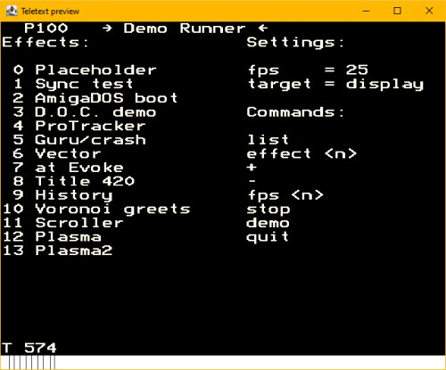

# How to run

Hardware prerequisites:
* buy a composite cable (I ordered [this](https://amzn.eu/7PVb49u), there may be better ones, YMMV – with this cable, composite
  video comes out of the red connector, audio is on the white and yellow ones)
* find a not-too-modern TV

Prerequisites on the Raspberry Pi:
* build [raspi-teletext](https://github.com/ali1234/raspi-teletext)
* [enable composite out](https://mlagerberg.gitbooks.io/raspberry-pi/content/3.5-analog-video-output.html) in Raspberry settings
* I also disabled X in raspi-config, only console is needed
* run `sudo ./tvctl on`
* receive packets from the network via `nc -l 2000 | ./teletext -`
* send Teletext packets to port 2000 on the Raspi
* see also: [NFO file](420-years-of-teletext.nfo)

Main entry points:

| What | Details |
|------|---------|
| Main.kt |  Interactive effect runner with fps control |
| DemoRunner.kt |  Interactive text-based demo runner; also with fps control and ability to output to a graphical preview, network, or both |

**Main.kt** can switch between differenct effects registered in `allEffects` (see [Main.kt](src/Main.kt)), convert a PNG to .bin format, dump rendered frames into a big file that can be piped to `./teletext -`.
The timing within an effect is often done with enums acting as little script tables.

**DemoRunner.kt** contains the overall timing, as well as the ability to go forward/backward one effect and
sync to the music clip's timing (priceless for syncing).
