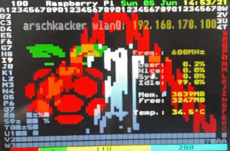

# Teletext packet format

Example page packets taken from https://github.com/ali1234/raspi-teletext/blob/master/demo_buffer.h

Demo buffer with two pages defined as: `uint8_t buffer[2][24][42]`
 * 24 rows
 * 42 data bytes

Teletext page on screen:
 * 1 header row
 * 23 page content rows
 * 40 columns
 * 1 navigation row (controllable with special packets presumably?)

Noteworthy:
* Page content bytes use highest bit for parity
   * `0x31` = "1"
   * `0xb9` = "9" (`0x39` without parity)
   * etc.
* Date in "source packets" below gets corrected on-the-fly (e.g. `0x39` for "9" gets fixed to `0xb9`)
* Other sections may be [hamming-encoded](hamming.md)
* Page numbers are given as hex (impossible-to-reach pages like "1FF" possible for custom Teletext data shit)

Analysis of static demo page (page 101 when `teletext` binary is running):


Source packets:

```
 {
/*  0 */  { 02 15 02 15 15 15 15 15 15 15     52 61 73 70 62 e5 f2 f2 79 20 d0 e9 20 57 e5 64 20 31 31 20 46 e5 62 20 31 b9 ba b0 b9 2f 32 34 },
/*  1 */  { c7 15     20 31 32 33 34 35 36 37 38 39 30 31 32 33 34 35 36 37 38 39 30 31 32 33 34 35 36 37 38 39 30 31 32 33 34 35 36 37 38 39 },
/*  2 */  { 02 02     20 32 20 20 20 20 20 20 20 20 20 20 20 20 20 11 7a 20 7f 7f 7f 7f 30 7d 20 20 20 20 20 20 20 20 20 20 20 20 07 20 32 20 },
/*  3 */  { c7 02     20 33 20 20 20 20 20 20 20 20 20 20 11 20 20 20 7f 78 27 7f 7f 2b 7d 7f 20 20 20 20 20 20 20 20 20 20 20 20 07 20 33 20 },
/*  4 */  { 02 49     20 34 20 20 20 20 20 20 20 20 20 20 20 11 68 20 7f 7f 20 3f 2b 20 7f 7f 20 75 20 20 20 20 20 20 20 20 20 20 07 20 34 20 },
/*  5 */  { c7 49     20 35 20 20 20 20 20 20 20 20 11 20 20 20 7e 20 7f 7f 20 20 20 20 7f 6f 34 7f 20 20 20 20 20 20 20 20 20 20 20 20 20 20 },
/*  6 */  { 02 5e     20 36 20 20 20 20 20 20 20 20 20 11 20 20 7f 7a 25 7f 20 20 20 20 7f 22 7f 7f 20 20 20 20 20 20 20 20 20 20 20 20 20 20 },
/*  7 */  { c7 5e     20 37 20 20 20 20 20 20 11 20 20 20 78 20 7f 7f 17 25 60 20 60 30 2a 11 7f 7f 20 75 20 20 20 20 20 20 20 20 20 20 20 20 },
/*  8 */  { 02 64     20 38 20 20 20 20 20 20 20 11 20 20 7f 68 37 7f 6d 17 7f 7c 37 7f 11 69 7f 6a 74 7f 20 20 20 20 20 20 20 20 20 20 20 20 },
/*  9 */  { c7 64     20 39 20 20 20 20 11 20 20 20 60 20 7f 7f 17 3f 20 20 7f 2b 7d 7f 20 7f 6f 11 7f 7f 20 74 20 20 20 20 20 20 20 20 20 20 },
/* 10 */  { 02 73     20 30 20 20 20 20 11 20 20 20 7e 60 7f 7f 17 25 20 20 7f 20 7f 7f 20 7f 22 11 7f 6f 74 7f 20 20 20 20 20 20 20 20 20 20 },
/* 11 */  { c7 73     20 31 20 20 20 20 20 11 60 20 7f 7e 25 7f 17 20 20 20 22 20 7f 7f 20 7f 11 20 7f 22 7f 7f 20 34 20 20 20 20 20 20 20 20 },
/* 12 */  { 02 38     20 32 20 20 11 20 20 20 7e 20 7f 7f 20 21 17 20 20 20 68 20 7f 7f 20 3f 20 20 2a 11 7f 7f 34 7f 20 20 20 20 20 20 20 20 },
/* 13 */  { c7 38     20 33 20 20 20 11 20 20 7f 7e 25 7f 20 20 17 20 20 20 7f 68 7f 7f 20 35 20 20 20 11 7f 6b 7d 7f 20 30 20 20 20 20 20 20 },
/* 14 */  { 02 2f     20 34 11 20 20 20 7e 20 7f 7f 20 27 20 20 17 20 20 20 7f 7f 7f 6f 20 35 20 20 11 20 7f 20 7f 7f 30 7d 20 20 20 20 20 20 },
/* 15 */  { c7 2f     20 35 11 20 20 20 7f 68 37 7f 20 20 20 20 17 20 20 20 3f 7f 7f 22 20 35 20 20 20 20 2a 11 7f 7f 7d 7f 20 20 20 20 20 20 },
/* 16 */  { 02 d0     20 36 20 11 60 20 7f 7f 20 3f 20 20 20 20 17 20 20 20 25 7f 7f 20 20 35 20 20 20 20 11 20 7f 2b 7f 7f 20 34 20 20 20 20 },
/* 17 */  { c7 d0     20 37 20 11 7e 60 7f 7f 20 20 20 20 20 20 20 17 7a 20 20 37 6f 20 20 35 20 20 20 20 11 20 6b 20 7f 7f 20 7d 20 20 20 20 },
/* 18 */  { 02 c7     20 38 20 20 7f 7a 25 7f 20 20 20 20 17 20 20 20 7f 20 7c 2d 7e 3c 20 35 20 20 20 20 11 20 20 20 7f 2b 7d 7f 20 20 20 20 },
/* 19 */  { c7 c7     20 39 7a 20 7f 7f 20 25 20 20 20 20 20 17 20 20 37 7a 22 20 2a 20 20 35 20 20 20 20 11 20 20 20 6b 20 7f 7f 20 75 20 20 },
/* 20 */  { 02 8c     20 30 7f 7a 35 7f 20 20 20 20 17 20 20 20 20 20 21 3f 20 20 60 20 20 7d 20 20 20 20 11 20 20 20 20 20 7f 6b 74 7f 20 20 },
/* 21 */  { c7 8c     20 31 7f 7f 20 7f 20 20 20 20 17 20 20 20 2a 20 20 25 20 20 20 20 25 23 20 20 20 20 11 20 20 20 20 20 7f 22 7f 7f 20 20 },
/* 22 */  { 02 9b     20 32 7f 7f 7f 7f 7f 7f 7f 7f 7f 7f 7f 7f 7f 7f 7f 7f 7f 7f 7f 7f 7f 7f 7f 7f 7f 7f 7f 7f 7f 7f 7f 7f 7f 7f 7f 7f 20 20 },
/* 23 */  { c7 9b     20 33 7f 7f 7f 7f 7f 7f 7f 7f 7f 7f 7f 7f 7f 7f 7f 7f 7f 7f 7f 7f 7f 7f 7f 7f 7f 7f 7f 7f 7f 7f 7f 7f 7f 7f 3f 7f 41 20 },
 }
```

| Where | Data | Interpretation |
|-------|------|----------------|
| Y=0 first 10 bytes | `02 15 02 15 15 15 15 15 15 15` | Header (page 101, subpage, charset/region...) |
| Y=0 rest           | `52 61 73 70 62 e5 f2 f2 79 20 d0 e9 20 57 e5 64 20 31 31 20 46 e5 62 20 31 b9 ba b0 b9 2f 32 34` | "Raspberry Pi  Wed 11 Feb 19:09/24" |
| Y=1 | `c7 15` `20 31 32 33 ...` | Two-byte MPAG and 40 bytes of data |
| Y=2 | `02 02` `20 32 20 20 ...` | Two-byte MPAG and 40 bytes of data |
| Y=3 | `c7 02` `20 33 20 20 ...` | Two-byte MPAG and 40 bytes of data |
| Y=3 | `02 49` `20 34 20 20 ...` | Two-byte MPAG and 40 bytes of data |

MPAGs un-hammed:
 * First 2 bytes yield 2 nibbles
 * Merge nibbles in reverse (merged = second << 4 | first, not the other way around)
 * Lower 3 bits = magazine, upper 5 bits = packet address (row)

| raw | unham | MPAG | mag | adr |
|-----|-------|------|-----|-----|
| 02 15 | 1 0 = 0001 0000 | 01 = 00000001 | 1 | 0 |
| c7 15 | 9 0 = 1001 0000 | 09 = 00001001 | 1 | 1 |
| 02 02 | 1 1 = 0001 0001 | 11 = 00010001 | 1 | 2 |
| c7 02 | 9 1 = 1001 0001 | 19 = 00011001 | 1 | 3 |
| 02 49 | 1 2 = 0001 0010 | 21 = 00100001 | 1 | 4 |
| c7 49 | 9 2 = 1001 0010 | 29 = 00101001 | 1 | 5 |
| 02 5e | 1 3 = 0001 0011 | 31 = 00110001 | 1 | 6 |
| c7 5e | 9 3 = 1001 0011 | 39 = 00111001 | 1 | 7 |
| 02 64 | 1 4 = 0001 0100 | 41 = 01000001 | 1 | 8 |
| c7 64 | 9 4 = 1001 0100 | 49 = 01001001 | 1 | 9 |
| 02 73 | 1 5 = 0001 0101 | 51 = 01010001 | 1 | 10 |
| c7 73 | 9 5 = 1001 0101 | 59 = 01011001 | 1 | 11 |
| 02 38 | 1 6 = 0001 0110 | 61 = 01100001 | 1 | 12 |
| c7 38 | 9 6 = 1001 0110 | 69 = 01101001 | 1 | 13 |
| 02 2f | 1 7 = 0001 0111 | 71 = 01110001 | 1 | 14 |
| c7 2f | 9 7 = 1001 0111 | 79 = 01111001 | 1 | 15 |
| 02 d0 | 1 8 = 0001 1000 | 81 = 10000001 | 1 | 16 |
| c7 d0 | 9 8 = 1001 1000 | 89 = 10001001 | 1 | 17 |
| 02 c7 | 1 9 = 0001 1001 | 91 = 10010001 | 1 | 18 |
| c7 c7 | 9 9 = 1001 1001 | 99 = 10011001 | 1 | 19 |
| 02 8c | 1 a = 0001 1010 | a1 = 10100001 | 1 | 20 |
| c7 8c | 9 a = 1001 1010 | a9 = 10101001 | 1 | 21 |
| 02 9b | 1 b = 0001 1011 | b1 = 10110001 | 1 | 22 |
| c7 9b | 9 b = 1001 1011 | b9 = 10111001 | 1 | 23 |


## Page header

According to https://pdc.ro.nu/teletext.html

> First is a packet with packet number 0. The first eight bytes of this packet are hammed, giving 8 four-bit nibbles when decoded.
> These are used to specify the page number (2 nibbles), sub-page and flags (4 nibbles) and more flags (2 nibbles) of the page which
> is to follow.

> The remaining 32 bytes of the packet are not hammed and carry the teletext header line, including the clock.
> They are protected instead by an odd parity check in bit 7.

Raw header bytes:

    Demo page 100:   0x02, 0x15,   0x15, 0x15,   0x15, 0x15, 0x15, 0x15,   0x15, 0x15
    Demo page 101:   0x02, 0x15,   0x02, 0x15,   0x15, 0x15, 0x15, 0x15,   0x15, 0x15


| What | Interpretation |
|---|---|
| `02 15` | MPAG for magazine 1, row 0 |
| `15 15` and `02 15` | Page number "00" and "01" (in magazine 1 as given by MPAG) |
| `15 15 15 15` | Sub-page "0000" (may contain "subtitle" and other flags)  |
| `15 15` | Flags "Suppress header", "Update", "Interrupted Sequence", "Inhibit Display", "Magazine Serial" + 3 region bits |

### Flags

Flags in sub-page number:

> Sub-page numbers are represented as hex, but with the 1st, 2nd and 9th most significant bits not used.
> This was designed so decimal times 0000 to 2359 will fit.
> The three spare bits are used here to code the Subtitle, Newsflash and Erase flags.
> Sub-page code 0x3F7F is reserved for special purposes.

Page header and flags, from spec (9.3.1 Page header):

| Byte number | Index* | Spec description                |
|------------:|-------:|---------------------------------|
|           1 |        | Clock run-in                    |
|           2 |        | Clock run-in                    |
|           3 |        | Framing code                    |
|           4 |      0 | MPAG                            |
|           5 |      1 | MPAG                            |
|           6 |      2 | Page ..X (units)                |
|           7 |      3 | Page .X. (tens)                 |
|           8 |      4 | Subcode S1                      |
|           9 |      5 | Subcode S2 + C4                 |
|          10 |      6 | Subcode S3                      |
|          11 |      7 | Subcode S5 + C5, C6             |
|          12 |      8 | Control bits C7, C8, C9, C10    |
|          13 |      9 | Control bits C11, C12, C13, C14 |
|          14 |     10 | Header data (32 bytes)          |

Index = byte index in line packet buffer data (no clock run-in and framing code; 0,1 = MPAG, 2,3 = page, etc.)

### Subcode and control bits

Spec: S1 = least significant, S4 = most significant. Subcode "1234" is sent as ham(4), ham(3), ham(2), ham(1)

| Byte number (index) | Name      | Bits*  | Content                     |
|--------------------:|-----------|--------|-----------------------------|
|               8 (4) | S1        | `SSSS` | subcode `...X`, 0-F         |
|               9 (5) | S2        | `.SSS` | subcode `..X.`, 0-7         |
|                     |           | `1...` | control bit C4 "Erase Page" |
|              10 (6) | S3        | `SSSS` | subcode `.X..`, 0-F         |
|              11 (7) | S4        | `..SS` | subcode `X...`, 0..F        |
|                     |           | `.1..` | C5 "Newsflash"              |
|                     |           | `1...` | C6 "Subtitle"               |
|              12 (8) | Ctrl Bits | `...1` | C7 "Suppress header"        |
|                     |           | `..1.` | C8 "Update indicator"       |
|                     |           | `.1..` | C9 "Interrupted sequence"   |
|                     |           | `1...` | C10 "Inhibit display"       |
|              13 (9) | Ctrl Bits | `...1` | C11 "Magazine serial"       |
|                     |           | `RRR.` | Region bits                 |

Bits = nibble before Hamming-encoding, becomes a byte afterwards; see page: [hamming](hamming.md)

Region bits:

| Control Bits | National Character Option |
|---|---|
| 000     | English  or  Polish          |
| 001     | German                       |
| 010     | Swedish                      |
| 011     | Italian                      |
| 100     | French                       |
| 101     | Spanish  or  Serbo-croat     |
| 110     | Turkish  or  Czechoslovakia  |
| 111     | Rumanian                     |

## Content

How does using the leftmost column look like? (All set to 0x20 before)

Perfectly usable:


## Partial updates?

> Packets numbered 1 to 24 contain text data to be placed on the corresponding row 1 to 24 of the display.
> Note that because the row is given by the packet number, rows can be sent out of order or duplicated,
> and some rows can be left unspecified. In combination with the "Erase Page", "News Flash" and "Sub-Title" flags,
> this can be used to update only certain parts of a page, or to save bandwith on a page with lots of blank lines.

Might be handy.

## Max. framerate

When using full page updates: 50 Hz, 25 Hz?
 * TODO: Teletext spec allows more lines than raspi-teletext uses?
 *lines 6 to 22 and 318 to 335

### Obervation 1: glitchy

Only sending one page (100) looks glitchy on the TV set.



> Page code 0xFF indicates a dummy packet which can be used to fill in gaps in transmission.

From the spec:

> If a magazine has only one displayable page (and in some other circumstances), it may be necessary to
indicate the completion of the transmission of that page by closing it with another page header packet.
Headers with pages addresses in the range XFF:0000 to XFF:3F7E are defined for use for this purpose.
These headers may be referred to as "Time Filling Headers", when they are used to keep the real-time
clock field updated in a magazine in parallel transmission mode.
 
Also, control bit in the flags contained in the sub-page bytes:

> C8 = Update Indicator

> Byte 12, bit 4

> Data within packets X/1 to X/28 of the associated page has been changed
> since the previous transmission. The setting of this bit is under editorial
>control.

### Obervation 2: slow decoder

Now using page 100 only + filler header for page 1FF.

Transmission is not the bottleneck.

2011 Samsung TV is crap (max. 4 fps). 2008 Sony Bravia can achieve ~ 15 fps with the occasional artefact and frame drops. Timing:

* Send page (42*24 bytes)
* Send 1FF filler header (42 bytes)
* Sleep 50 ms

